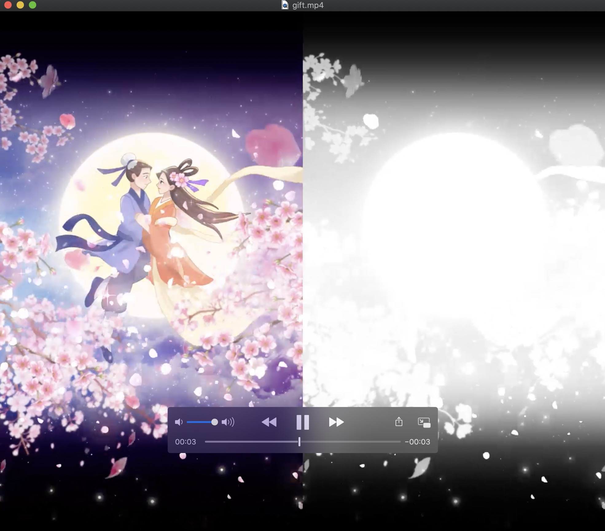
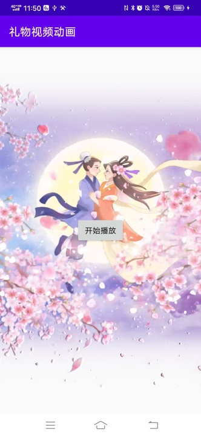

### 一、Alpha视频是什么？

答：视频在除了RGB三色信息外，还要带有Alpha通道信息。即拥有 RGBA 四个数据组。就是32位色彩的图形或视频。Alpha通道和RGB色彩通道的表示方式一样，也是一组8位色彩深度的黑白信息。但使用方法有所不同，它只用来标明图形内RGB组合后的彩色像素应该有多少透明度，黑色代表色彩完全透明，白色代表色彩完全不透明，灰色则代表色彩的透明程度。这种图形或视频所带的Alpha信息，能被一些较专业的软件所辨认。可以在几个图形叠加时，让最上层的图形透出下层图形的色彩信息，从而表现一些复杂的色彩关系。
更详细的定义参考链接 https://www.zhihu.com/question/64162978

### 二、Alpha视频的应用场景

答：通常用于游戏、直播、泛娱乐社交类应用的APP展示带有透明度的动画，例如礼物动画、玩家进场特效动画、广告推广特效动画等

### 三、本项目支持的动画类型

答：支持以下四种类型的Alpha视频
   左色彩右Alpha: 即视频的左侧50%存储RGB色彩信息，右侧50%用黑白色的深度表示左侧视频的Alpha，黑色(000000)表示Alpha=00，白色(FFFFFF)表示Alpha=FF
   左Alpha右色彩: 类比上一条
   上色彩下Alpha: 即视频的上半部分50%存储RGB色彩信息，下半部分50%用黑白色的深度表示左侧视频的Alpha，黑色(000000)表示Alpha=00，白色(FFFFFF)表示Alpha=FF
   下色彩上Alpha: 类比上一条

用于 播放 带有透明度信息的 礼物动画视频

原始视频的截图如下，视频左侧一半 彩色部分 为 没有透明度的视频，视频右侧一半 黑白部分 为 透明度 信息，白表示 alpha=1，黑表示 alpha=0

支持 左彩右黑白，和 左黑白右彩色 两种，有需要的话自己修改一下代码就行
GiftRenderer.alphaShader 对应 左彩右黑白
GiftRenderer.alphaShader2 对应 左黑白右彩色

源视频文件，如下图所示:

合成后的效果图如下：

