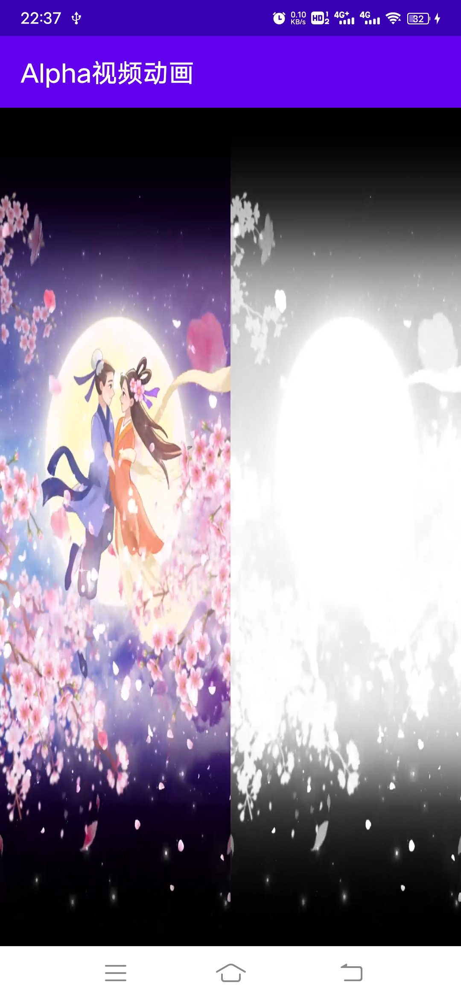
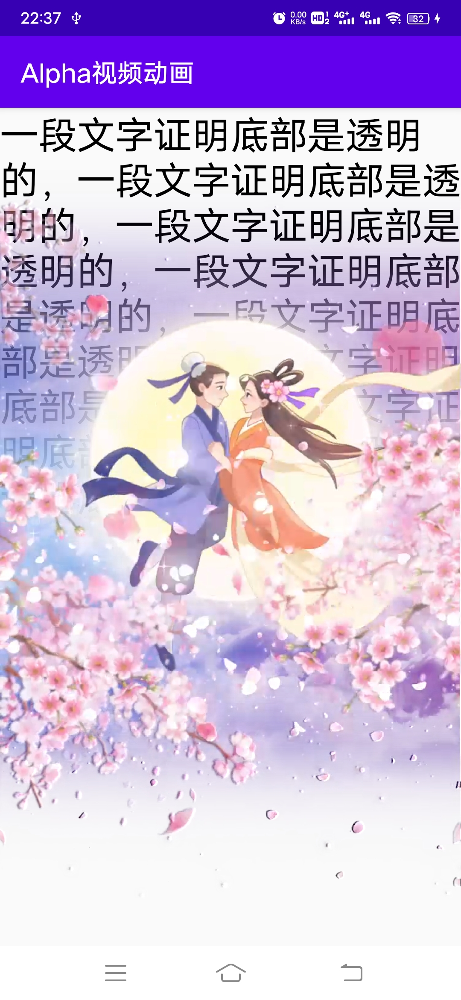
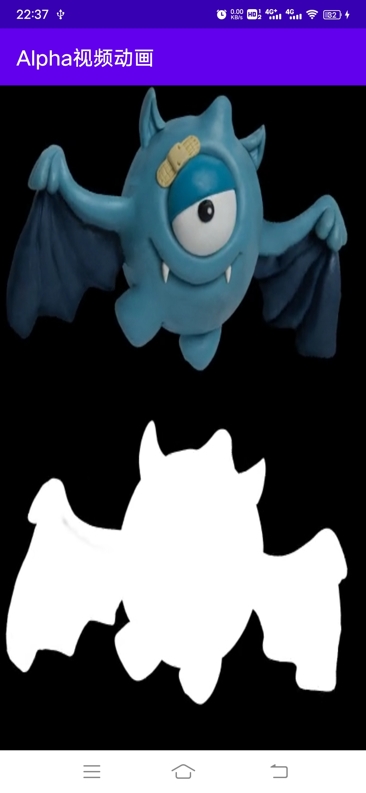

### 一、Alpha视频是什么？

答：视频在除了RGB三色信息外，还要带有Alpha通道信息。即拥有 RGBA 四个数据组。就是32位色彩的图形或视频。Alpha通道和RGB色彩通道的表示方式一样，也是一组8位色彩深度的黑白信息。但使用方法有所不同，它只用来标明图形内RGB组合后的彩色像素应该有多少透明度，黑色代表色彩完全透明，白色代表色彩完全不透明，灰色则代表色彩的透明程度。这种图形或视频所带的Alpha信息，能被一些较专业的软件所辨认。可以在几个图形叠加时，让最上层的图形透出下层图形的色彩信息，从而表现一些复杂的色彩关系。
更详细的定义参考链接 https://www.zhihu.com/question/64162978

### 二、Alpha视频的应用场景

答：通常用于游戏、直播、泛娱乐社交类应用的APP展示带有透明度的动画，例如礼物动画、玩家进场特效动画、广告推广特效动画等

### 三、本项目支持的色彩与Alpha通道布局类型

答：支持以下四种类型的Alpha视频

1. 左色彩右Alpha:

   即视频的左侧50%存储RGB色彩信息，右侧50%用黑白色的深度表示左侧视频的Alpha，黑色(000000)表示Alpha=00，白色(FFFFFF)表示Alpha=FF

2. 左Alpha右色彩: 类比上一条

3. 上色彩下Alpha:

   即视频的上半部分50%存储RGB色彩信息，下半部分50%用黑白色的深度表示左侧视频的Alpha，黑色(000000)表示Alpha=00，白色(FFFFFF)表示Alpha=FF

4. 下色彩上Alpha: 类比上一条

### 四、运行效果截图

| 左右分布的原始视频 | 左右分布的视频合成后的效果 | 上下分布的原始视频  | 上下分布的视频合成后的效果 |
| --- | --- | --- | --- |
|||| |

### 五、下载体验apk

体验版apk安装包的体积有点大，这是因为把alpha视频都内置到apk里面了，实际代码文件的体积占比是非常小的，小伙伴不要怀疑，代码没有冗余，放心使用

